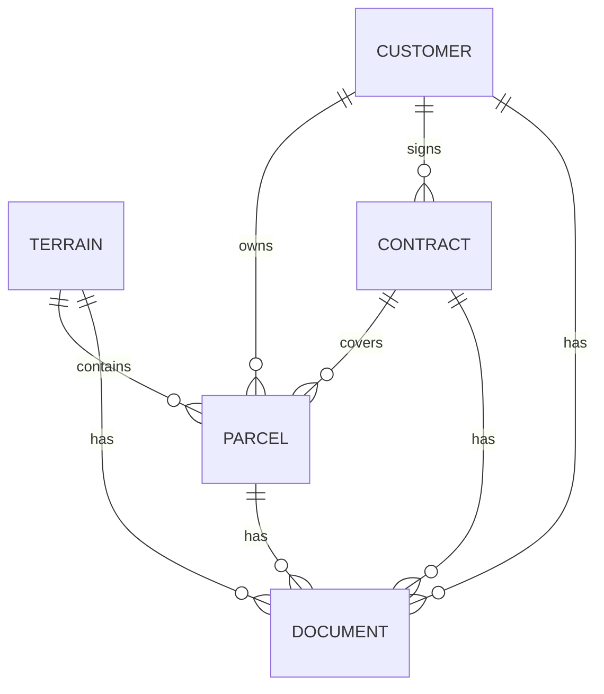

# Monaradi Database & Architecture Guide

## 1. Project Overview
Monaradi is a land parcel management system that integrates AI boundary detection (via Google Gemini) with cadastral management. 
**Goal:** Manage massive terrains, detect individual parcels via AI, assign owners (Customers), and generate sale contracts.

---

## 2. Architecture & Technology Stack
- **Database Engine**: SQLite (Development), PostgreSQL (Production target).
- **ORM**: Prisma v7.4.0 (Latest).
- **Backend Framework**: Express.js with TypeScript.
- **AI Integration**: Google Gemini via n8n workflows and direct API.

### Critical Prisma 7 Configuration
- **Schema File**: `backend/prisma/schema.prisma` defines the structure.
- **Configuration**: `backend/prisma.config.ts` handles the database connection configuration.
- **Rule**: NEVER define `url` inside the `datasource` block in `schema.prisma`. It must be passed via `prisma.config.ts` or the `PrismaClient` constructor.

---

## 3. Core Domain Models

### **Terrain (The Root)**
Represents a large area of land (formerly "Project"). 
- **Role**: The parent entity containing the satellite image and reference data.
- **Key Fields**: 
  - `imageData`/`imagePath`: The base map.
  - `scaleFactor`: For converting pixels to real-world meters.
  - `refLineData`: JSON data for calibration.

### **Parcel (The Unit)**
Represents a specific piece of land *inside* a Terrain.
- **Role**: The sellable unit.
- **Status Enum**: `AVAILABLE` | `SOLD`.
- **Key Relations**:
  - Belongs to one `Terrain`.
  - Can be owned by one `Customer` (Buyer).
  - Can be linked to one `Contract` (Sale Agreement).

### **Customer (The Actor)**
Represents an individual buyer.
- **Rule**: Customers are strictly *individuals*. No complex corporate structures.
- **Key Relations**:
  - `purchasedParcels`: List of parcels they own.
  - `contracts`: List of contracts they have signed.

### **Contract (The Legal Document)**
Represents a sale agreement.
- **Rule**: Contracts are strictly for *Sales*. No "Lease" or complex types.
- **Key Relations**: 
  - Links one `Customer` to multiple `Parcels`.

### **Document**
Generic storage for files.
- **Role**: Stores PDFs, Images, etc.
- **Relations**: Can be linked to Terrains, Parcels, Customers, or Contracts.

---

## 4. Entity Relationship Diagram (ERD) Summary

- **Terrain -> Parcel**: One-to-Many (Cascade Delete).
- **Customer -> Parcel**: One-to-Many (SetNull on delete).
- **Contract -> Parcel**: One-to-Many (SetNull on delete).
- **Customer -> Contract**: One-to-Many (Cascade Delete).

---

## 5. Rules for AI Agents

### 🚨 STRICT ENFORCEMENT REQUIRED

1.  **NO "Project" Entity**: The concept of "Project" has been merged into `Terrain`. Do not create or reference a separate Project model.
2.  **NO "Transaction" Entity**: Financial transactions are implicit. A sale is recorded when a `Parcel` status changes to `SOLD` and is linked to a `Customer` and `Contract`. Do NOT create a Transaction table.
3.  **NO "Roles"**: There is only one Owner (the system admin/user) and multiple Customers (buyers). Do not create `ContractParty` join tables with "roles".
4.  **Prisma 7 Compatibility**: 
    - Always use `prisma.config.ts` for migration/push commands.
    - Always instantiate client with `new PrismaClient({ datasourceUrl: process.env.DATABASE_URL })`.
    - Never add `url = env(...)` to `schema.prisma`.
5.  **Simplify**: Keep the schema flat. Avoid complex many-to-many join tables unless absolutely necessary (currently none exist).
